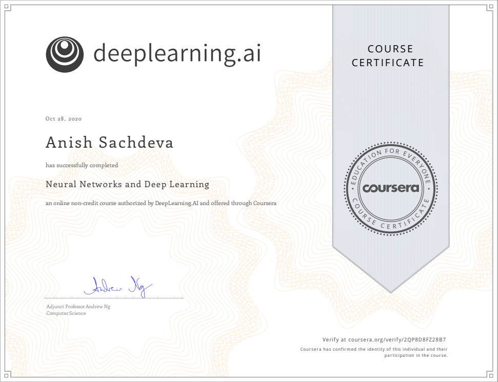

# Neural Networks & Deep Learning @Coursera
__Course by deeplearning.ai__

This is part of the 5 course specialization on 
[Deep Learning](https://github.com/anishLearnsToCode/deep-learning-ai) 
on Coursera. This is the first course.

## Index
- [Week 1](#week-1)
- [Week 2](#week-2)
- [Week 3](#week-3)
- [Week 4](#week-4)
- [Certificate](#-certificate)

## Week 1
- [Quiz: Introduction to Deep Learning](week_1/introduction-to-deep-learning-quiz.md)

## Week 2
- [Quiz: Neural Networks Basics](week_2/neural-networks-basics-quiz.md)
- [Lab: Python Basics With Numpy (Optional)](week_2/Python_Basics_With_Numpy.ipynb)
- [Programming Assignment: Logistic Regression with a Neural Network](week_2/logisic-regression-as-a-neural-network/Logistic_Regression_with_a_Neural_Network_mindset.ipynb)

## Week 3
- [Quiz: Shallow Neural Networks](week_3/shallow-neural-networks.md)
- [Programming Assignment: Planar data classification with a hidden layer](week_3/planar-classification-with-one-hidden-layer/Planar_data_classification_with_onehidden_layer.ipynb)

## Week 4
- [Quiz: Key Concepts on Deep Neural Networks](week_4/quiz-key-concepts-deep-neural-networks.md)
- [Programming Assignment: Building your deep neural network step by step](week_4/building-your-deep-neural-network-step-by-step/Building_your_Deep_Neural_Network_Step_by_Step_v8a.ipynb)
- [Programming Assignment: Deep Neural Network Application](week_4/deep-neural-network-application-image-classification/Deep+Neural+Network+-+Application+v8.ipynb)

## [🎓 Certificate](http://coursera.org/verify/2QP8D8FZ28B7)

